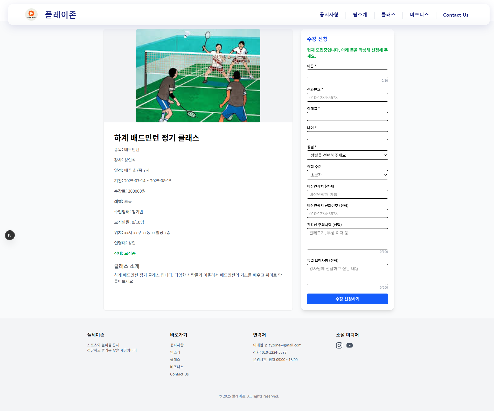
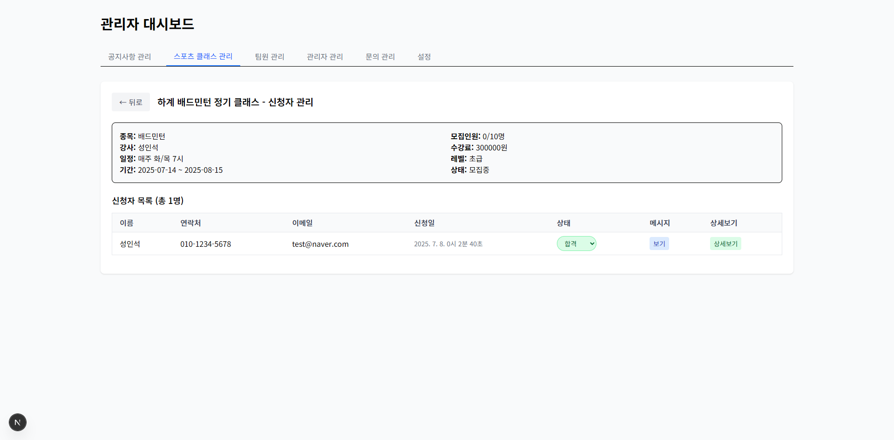
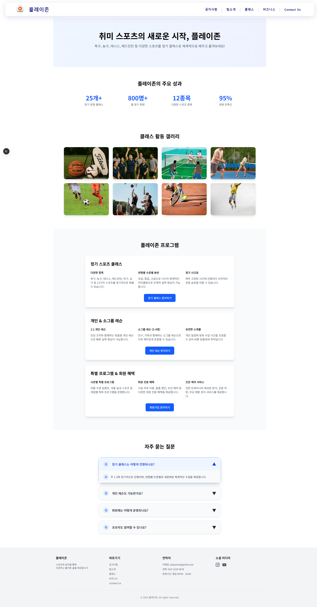

# 플레이존(PlayZone) - 스포츠 클래스 예약 플랫폼

> **Next.js**와 **NestJS**를 활용한 현대적인 풀스택 웹 애플리케이션

## 프로젝트 개요

**플레이존**은 프론트엔드 디자인 감각과 백엔드 아키텍처 설계 능력을 종합적으로 향상시키기 위해 개발한 **가상의 스포츠 클래스 예약 플랫폼**입니다.

### 개발 목적
- **프론트엔드 스킬 향상**: 현대적인 UI/UX 디자인, 애니메이션 효과, 반응형 레이아웃 구현
- **백엔드 아키텍처 학습**: NestJS 모듈 시스템, JWT 인증, TypeORM을 활용한 데이터베이스 설계
- **풀스택 개발 경험**: 프론트엔드와 백엔드를 연동한 완전한 웹 애플리케이션 구축
- **실무 환경 시뮬레이션**: Docker를 통한 개발/배포 환경 분리, 실제 서비스 운영 시나리오 적용

### 주요 구현 요소
- **세련된 UI/UX**: 타이핑 효과, 마우스오버 블러 처리, 부드러운 페이지 전환
- **직관적인 사용자 경험**: 단계별 신청 과정, 실시간 상태 피드백
- **체계적인 관리 시스템**: 신청자 정보 관리, 상태 추적, 상세 정보 모달

## 프로젝트 스크린샷

### 메인 페이지

*현대적인 디자인의 메인 페이지 - 서비스 소개 및 클래스 신청 안내*

### 클래스 신청 페이지  

*직관적인 클래스 신청 폼 - 개인정보, 경험수준, 건강상태 등 체계적 정보 수집*

### 관리자 대시보드

*실시간 신청자 관리 - 상세정보 조회, 승인/거절 처리, 상태 추적*

### 비즈니스 페이지

*서비스 소개 및 갤러리 - 클래스 활동 사진과 프로그램 안내*

## 주요 특징

- **현대적인 풀스택 아키텍처**: Next.js 15 + NestJS
- **반응형 디자인**: Tailwind CSS를 활용한 모바일 최적화
- **안전한 인증 시스템**: JWT 기반 사용자 인증 및 권한 관리
- **실시간 관리자 대시보드**: 신청자 관리 및 상태 추적
- **컨테이너화**: Docker를 통한 배포 및 확장성

## 기술 스택

### Frontend
- **Framework**: Next.js 15
- **Language**: TypeScript
- **Styling**: Tailwind CSS
- **HTTP Client**: Axios

### Backend
- **Framework**: NestJS
- **Language**: TypeScript
- **Database**: MySQL with TypeORM
- **Authentication**: Passport.js + JWT
- **API Documentation**: Swagger
- **Security**: bcrypt for password hashing

### DevOps & Tools
- **Containerization**: Docker & Docker Compose
- **Package Manager**: npm

## 핵심 기능

### 사용자 기능
- **회원가입 및 로그인**: JWT 기반 안전한 인증
- **스포츠 클래스 탐색**: 카테고리별 클래스 검색
- **클래스 신청**: 실시간 신청 및 상태 확인
- **개인정보 관리**: 프로필 수정 및 신청 내역 조회

### 관리자 기능
- **대시보드**: 신청자 통계 및 현황 모니터링
- **신청 관리**: 클래스 신청 승인/거절 처리
- **상세 정보 확인**: 신청자별 상세 정보 조회
- **상태 관리**: 실시간 신청 상태 업데이트

### 콘텐츠 관리
- **공지사항**: 중요 공지 작성 및 관리
- **문의사항**: 사용자 문의 접수 및 답변
- **갤러리**: 클래스 활동 사진 관리

## 프로젝트 구조

```
my-app/
├── front/                 # Next.js Frontend
│   ├── src/
│   │   ├── app/
│   │   │   ├── (admin)/   # 관리자 페이지
│   │   │   └── (main)/    # 메인 사용자 페이지
│   │   └── components/    # 재사용 컴포넌트
│   ├── public/            # 정적 파일
│   └── uploads/           # 업로드 파일
├── back/                  # NestJS Backend
│   ├── src/
│   │   ├── auth/          # 인증 모듈
│   │   ├── admin/         # 관리자 모듈
│   │   ├── user/          # 사용자 모듈
│   │   ├── entities/      # 데이터베이스 엔티티
│   │   └── guard/         # 인증 가드
│   └── uploads/           # 업로드 파일
├── docker-compose.yml     # 개발환경 Docker 설정
└── docker-compose.prod.yml # 프로덕션 Docker 설정
```

## 시작하기

### 필수 조건
- Node.js 18 이상
- Docker & Docker Compose
- MySQL 8

### 설치 및 실행

1. **저장소 클론**
```bash
git clone https://github.com/HaeSung99/fullstack-website.git
cd fullstack-website
```

2. **환경 변수 설정**
프로젝트 루트에 `.env` 파일을 생성하고 다음 내용을 입력하세요:

```env
# MySQL 데이터베이스 설정
MYSQL_ROOT_PASSWORD=
MYSQL_DATABASE=
MYSQL_USER=
MYSQL_PASSWORD=

# NestJS 데이터베이스 연결 설정
DB_HOST=
DB_PORT=
DB_USERNAME=
DB_PASSWORD=
DB_NAME=

# JWT 토큰 설정
JWT_SECRET=
```

3. **Docker로 실행 (권장)**
```bash
# 개발환경 (핫리로드 지원)
docker-compose up --build
```

4. **로컬 개발 환경**
```bash
# Backend 실행
cd back
npm install
npm run start:dev

# Frontend 실행 (새 터미널)
cd front
npm install
npm run dev
```

**참고**: 로컬 개발 시에는 MySQL을 별도로 설치하고 실행해야 합니다.
```bash
# MySQL 설치 (macOS - Homebrew)
brew install mysql
brew services start mysql

# MySQL 설치 (Ubuntu)
sudo apt-get install mysql-server
sudo systemctl start mysql
```

### 접속 정보
- **Frontend**: http://localhost:3000
- **Backend API**: http://localhost:4000
- **API Documentation**: http://localhost:4000/api-docs

## 핵심 API 엔드포인트

```
POST   /auth/login                 # 로그인
POST   /user/sports-class/enroll   # 클래스 신청
GET    /admin/enrollments          # 신청자 목록 조회
PUT    /admin/enrollments/:id      # 신청 상태 변경
```

## 주요 구현 내용

### 1. 모듈형 아키텍처 (NestJS)
NestJS의 모듈 시스템을 활용하여 기능별로 완전히 분리된 아키텍처를 구성했습니다.

**모듈 구조:**
- **AuthModule**: 인증/로그인 관련 기능
- **AdminModule**: 관리자 대시보드 및 관리 기능  
- **UserModule**: 사용자 관련 기능 (클래스 신청 등)

**장점:**
- 각 모듈이 독립적으로 동작
- 코드 재사용성 및 유지보수성 향상

### 2. Docker 개발/배포 환경 최적화

**개발환경 - 핫리로드 설정:**
```yaml
# docker-compose.yml
volumes:
  - ./back:/app          # 소스코드 실시간 동기화
  - /app/node_modules    # node_modules 충돌 방지
environment:
  - CHOKIDAR_USEPOLLING=true   # 파일 변경 감지 (Backend)
  - WATCHPACK_POLLING=true     # 파일 변경 감지 (Frontend)
command: npm run start:dev     # 개발 모드로 실행
```

**배포환경 - 헬스체크 시스템:**
```yaml
# docker-compose.prod.yml  
healthcheck:
  test: ["CMD", "curl", "-f", "http://localhost:4000"]
  interval: 30s    # 30초마다 체크
  timeout: 10s     # 10초 타임아웃
  retries: 3       # 3번 실패시 컨테이너 재시작
```

### 3. 보안 시스템
- **JWT 토큰 인증**: 무상태(stateless) 인증 방식
- **bcrypt 해싱**: 비밀번호 단방향 암호화 (salt rounds 사용)
- **가드(Guard) 패턴**: 라우트별 접근 권한 제어

### 4. 사용자 경험 최적화  
- **반응형 디자인**: Tailwind CSS로 모바일-데스크톱 대응
- **실시간 피드백**: 신청 상태 즉시 업데이트
- **직관적 UI**: 관리자 대시보드의 상세정보 모달

## 개발 프로세스

- **점진적 개발**: 기본 기능부터 고급 기능까지 단계별 구현
- **사용자 피드백 반영**: 실제 사용성을 고려한 UI/UX 개선 (자체 피드백)
- **타입 안전성**: TypeScript를 통한 런타임 에러 방지
- **컨테이너 기반 개발**: Docker로 일관된 개발/배포 환경 유지
- **모듈형 설계**: 기능별 독립적인 모듈로 확장성과 유지보수성 확보

## 기술적 특징

### 핫리로드 (개발환경)
- **실시간 코드 변경 감지**: 코드 수정 시 자동으로 애플리케이션 재시작
- **Volume 마운트**: 호스트와 컨테이너 간 실시간 파일 동기화
- **폴링 방식**: CHOKIDAR_USEPOLLING으로 안정적인 파일 감지

### 헬스체크 (배포환경)  
- **자동 상태 모니터링**: 30초마다 애플리케이션 응답 확인
- **장애 복구**: 3회 연속 실패 시 컨테이너 자동 재시작
- **무중단 배포**: 헬스체크 통과 후 트래픽 라우팅

### 모듈형 아키텍처
- **느슨한 결합**: 각 모듈이 독립적으로 동작하며 인터페이스로만 소통
- **높은 응집도**: 관련 기능들을 하나의 모듈에 집중
- **재사용성**: 모듈 단위로 다른 프로젝트에 재활용 가능


## 연락처

**개발자**: [GitHub 프로필](https://github.com/HaeSung99)

---